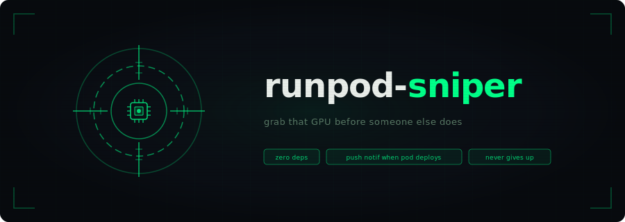

<p align="center">
  
</p>

TL;DR `runpod-sniper` is a bash script that attempts to deploy a RunPod GPU Pod until one is available.

## About

Somtimes you need to spin up a [RunPod GPU Pod](https://www.runpod.io/product/cloud-gpus), but there aren't any of the type you need available. Dang!

What if you need to generate some [images of cats](https://www.kaggle.com/datasets/mhassansaboor/ai-generated-cats-high-res-images-and-prompts) like, right now? Or how about if your [TPS report](https://en.wikipedia.org/wiki/TPS_report#Office_Space) is late and you've fine-tuned an open-weight LLM to generate it just the way the [pointy-haired boss](https://dilbert.fandom.com/wiki/Pointy-Haired_Boss) likes?

Well fear not! `runpod-sniper` is a bash script that attempts to deploy a RunPod GPU Pod until one is available. It cycles through a prioritized list of GPU types on each attempt, and exits as soon as a pod is successfully created. It'll even send you a push notification using [nfty.sh](https://ntfy.sh/) and show a desktop notif ones it gets your Pod going so you can stop reading [HN](https://news.ycombinator.com/) and get back to work. It has no external dependencies, so you can run it [wherever](https://www.reddit.com/media?url=https%3A%2F%2Fi.redd.it%2F9ldzrbzra3bz.jpg).

## Setup

Copy the example preset and edit it to include your API key and desired settings:

```bash
cp configs/example.conf configs/my.conf
$EDITOR configs/my.conf
```

(You can get an API key at [https://www.runpod.io/console/user/settings](https://www.runpod.io/console/user/settings).)

Preset files you create (`configs/*.conf`) are gitignored. Only `configs/example.conf` is tracked, so it's safe(ish) to put your API key in your own preset.

## Usage

```bash
./runpod-sniper.sh configs/my.conf
```

Or via environment variable if you're feeling fancy:

```bash
CONFIG=configs/my.conf ./runpod-sniper.sh
```

If `RUNPOD_API_KEY` is empty in the config, the script will prompt for it at runtime.

Upon successfully grabbing a Pod, the script will return RunPod's response body, which includes metadata like the Pod ID. Isn't that swell?

## Config fields

All keys must be defined (the script errors on any undeclared key). Empty strings are allowed for optional values. See [configs/example.conf](configs/example.conf):

```bash
RUNPOD_API_KEY=""                   # get one at https://www.runpod.io/console/user/settings
GPU_TYPES=("NVIDIA L40S" "NVIDIA RTX 6000 Ada Generation")  # Priority-ordered list of GPU types to try.
                                                            # See docs.runpod.io/references/gpu-types
GPU_COUNT=1                         # GPUs per pod
CLOUD_TYPE="SECURE"                 # SECURE | COMMUNITY | ALL
IMAGE="runpod/pytorch:2.4.0-py3.11-cuda12.4.1-devel-ubuntu22.04"  # container image
                                                                  # (optional if TEMPLATE_ID is set)
CONTAINER_DISK=50                   # container disk size in GB (optional if TEMPLATE_ID is set)
VOLUME_DISK=256                     # volume disk size in GB (ignored if VOLUME_ID is set)
                                    # (optional if TEMPLATE_ID is specified)
TEMPLATE_ID=""                      # RunPod template name/ID (optional if IMAGE is set)
VOLUME_ID=""                        # network volume ID (optional)
POD_NAME=""                         # defaults to `launched-<timestamp>` if blank
POLL_INTERVAL=60                    # seconds between retries
NTFY_TOPIC=""                       # sends a push notification using ntfy.sh/<topic> (optional)
MACOS_NOTIFY=false                  # displays a macOS desktop notification on success if enabled
```

`NTFY_TOPIC` uses [ntfy.sh](https://ntfy.sh), a free no-signup push-notification service. Pick any unguessable topic name and subscribe to it from the ntfy app or browser. The script POSTs a success message to that topic when a pod is grabbed.

## Tests

```bash
./tests/test-runpod-sniper.sh   # offline tests, then prompts for an API key
                                # to run a live create+delete round-trip
                                # (press enter with no input to skip the live portion)
```

The live portion briefly provisions a real (billed) pod for a few seconds before deleting it. Skip it if you'd rather not be charged.

## License

MIT - see [LICENSE](LICENSE)